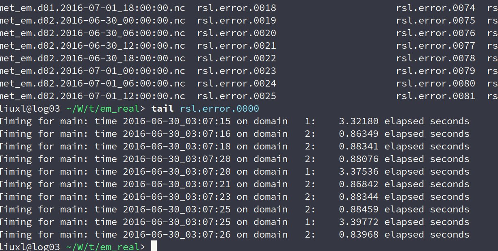

### **湖北个例模拟情况**
#### &nbsp;&nbsp;&nbsp;&nbsp;&nbsp;&nbsp;&nbsp;&nbsp;模拟时间为2016年6月30日，00时至12时
----
#### 时间步长为15s，微物理方案为8，计算了1小时15分
<center>
<figure>

</figure>
</center>

----
#### 时间步长为5s，微物理方案为8，计算了3小时7分
<center>
<figure>

</figure>
</center>

----
#### 时间步长为2s，微物理方案16。计算7小时14分停止
<center>
<figure>

</figure>
</center>

---
####  时间步长为5s，微物理方案9。提交作业没有输出文件wrfout，和报错文件rsl
####  时间步长为15s，微物理方案9。提交作业没有输出文件wrfout，和报错文件rsl

#### &nbsp;&nbsp;&nbsp;&nbsp;&nbsp;&nbsp;&nbsp;&nbsp;目前进度: 在尝试Thomphon(8)微物理方案和Milbrandt 2-mom(9)微观物方案能否正常积分。昨天提交作业出现互信问题，问题在于.ssh文件权限问题，使作业没有真正提交成功。所以没有输出文件和报错文件，目前该情况已解决。由于征信问题也会导致作业莫名其妙停下来，所以不清楚，之前停下来是否因为互信问题。

### 附件
``````
为什么需要不同服务器之间的ssh互信？

我们在log节点 (log01 - log05) 上提交作业之后，作业执行的信息是通过 ssh 传到计算节点上进行运算。这个过程必须是无密码ssh登录 (因为用户不可能在作业进行中间输入密码)。Linux系统对 ssh 通过秘钥无密码登录有一些要求，主要是需要保证用户的账号是安全的，他的私钥不会被其他人窃取。如果用户账号没有达到系统的要求，系统就要拒绝 ssh 无密码登录。很多的时候，用户作业因为一下莫名其妙的原因停下来就是因为 ssh 互信出问题了。


如何测试账号的 ssh 互信是否正常？

如果你能够从一个登录节点 (例如log01) 用 ssh 无密码登录另一个节点 (例如log02)，你的账号应该是没问题的。如果系统提示你输入密码，你就有问题了。你将不能提交作业。


如何保证你的账号设置正常？

如果你发现你的账号不能无密码登录其它的log节点，请先运行下面三个指令：

chmod 750 $HOME
chmod 700 $HOME/.ssh
chmod 600 $HOME/.ssh/*

然后再测试是否能够无密码登录其它log节点。如果还有问题，就运行 "chmod 700 $HOME"，然后再试。如果还是不成功，请联系系统管理员。
``````
