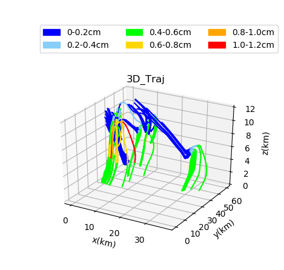
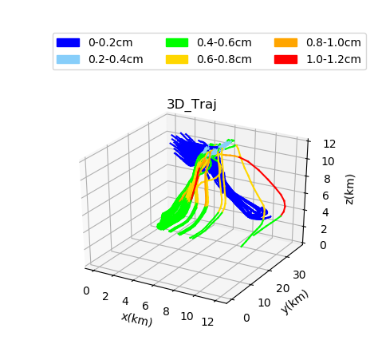
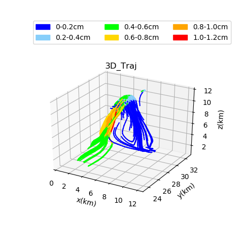
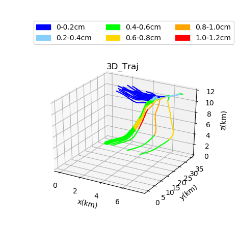

#### 轨迹图
---
##### 
调整颜色阈值后的轨迹图

---
#### 上图轨迹分为四组，冰雹半径最大为1.12cm，选择四组轨迹中冰雹半径能增长至1.0-1.2cm的轨迹，得到图如下所示。
---
##### 
挑选一组轨迹图

---
#### 通过逐条轨迹查看分析，挑选的一组轨迹又可以将其分为A、B两类
---
##### 
A类

---
##### 
B类

---
