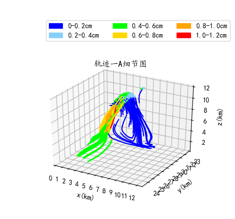
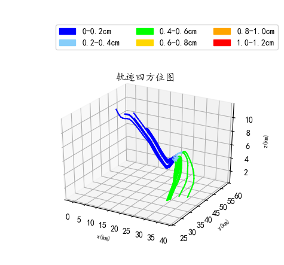

### **冰雹轨迹图**
---
#### 整体轨迹图
<div align=center>
---
#### &nbsp;&nbsp;&nbsp;&nbsp;轨迹分为四组，冰雹半径最大为1.12cm
---
<center>轨迹一(A)</center>
<center>
<figure>


</figure>
</center>

---
<center>轨迹一(B)</center>
<center>
<figure>


</figure>
</center>

---
<center>轨迹二</center>
<center>
<figure>


</figure>
</center>

---
<center>轨迹三</center>
<center>
<figure>


</figure>
</center>

---
<center>轨迹四</center>
<center>
<figure>


</figure>
</center>

----
### **湖北个例情况**
#### &nbsp;&nbsp;&nbsp;&nbsp;&nbsp;&nbsp;&nbsp;&nbsp;模拟时间为2016年6月30日，00时至12时，微物理方案调整为WDM6方案(16)，时间步长为2。由于积分时间步长较短，超过Regular队列最大运算时间，作业被中断，目前输出文件积分时长超过6小时如下图。
<center>
<figure>

</figure>
</center>

---
### **附件**
#### 模拟区域
<center>
<figure>

</figure>
</center>

---
``````
#  namelist.input

 &time_control
 run_days                            = 0,
 run_hours                           = 18,
 run_minutes                         = 0,
 run_seconds                         = 0,
 start_year                          = 2016, 2016,
 start_month                         = 06,   06, 
 start_day                           = 30,   30,
 start_hour                          = 00,   00,
 start_minute                        = 00,   00,
 start_second                        = 00,   00,
 end_year                            = 2016, 2016,
 end_month                           = 06,   06,  
 end_day                             = 30,   30,  
 end_hour                            = 12,   12,  
 end_minute                          = 00,   00,  
 end_second                          = 00,   00,  
 interval_seconds                    = 21600
 input_from_file                     = .true.,.true.,.true.,
 history_interval                    = 180,  60,  
 frames_per_outfile                  = 1000, 1000,
 restart                             = .false.,
 restart_interval                    = 5000,
 io_form_history                     = 2
 io_form_restart                     = 2
 io_form_input                       = 2
 io_form_boundary                    = 2
 debug_level                         = 0
 /

 &domains
 time_step                           = 2,
 time_step_fract_num                 = 0,
 time_step_fract_den                 = 1,
 max_dom                             = 2,
 e_we                                = 340,   676,
 e_sn                                = 303,   439,
 e_vert                              = 51,    51,
 p_top_requested                     = 5000,
 num_metgrid_levels                  = 32,
 num_metgrid_soil_levels             = 4,
 eta_levels = 1.0000,0.9980,0.9940,0.9870,0.9750,0.9590,0.9390,0.9160,0.8920,0.8650,0.8350,0.8020,0.7660,0.7270,0.6850,0.6400,0.5920,0.5420,0.4970,0.4565,0.4205,0.3877,0.3582,0.3317,0.3078,0.2863,0.2670,0.2496,0.2329,0.2188,0.2047,0.1906,0.1765,0.1624,0.1483,0.1342,0.1201,0.1060,0.0919,0.0778,0.0657,0.0568,0.0486,0.0409,0.0337,0.0271,0.0209,0.0151,0.0097,0.0047,0.0000,
 dx                                  = 3000, 1000, 
 dy                                  = 3000, 1000, 
 grid_id                             = 1,     2,    
 parent_id                           = 0,     1,    
 i_parent_start                      = 1,     52,   
 j_parent_start                      = 1,     70,   
 parent_grid_ratio                   = 1,     3,    
 parent_time_step_ratio              = 1,     3,    
 feedback                            = 1,
 smooth_option                       = 0
 /

 &physics
 mp_physics                          = 16,     16,    
 ra_lw_physics                       = 1,     1,    
 ra_sw_physics                       = 1,     1,    
 radt                                = 6,     2,   
 sf_sfclay_physics                   = 1,     1,    
 sf_surface_physics                  = 2,     2,    
 bl_pbl_physics                      = 99,    99,    
 cu_physics                          = 0,     0,    
 cudt                                = 0,     0,    
 isfflx                              = 1,
 ifsnow                              = 0,
 icloud                              = 1,
 surface_input_source                = 1,
 num_soil_layers                     = 4,
 sf_urban_physics                    = 0,     0,    
 /

 &fdda
 /

 &dynamics
 w_damping                           = 0,
 diff_opt                            = 1,        
 km_opt                              = 4,        
 diff_6th_opt                        = 0,      0,   
 diff_6th_factor                     = 0.12,   0.12,
 base_temp                           = 290.
 damp_opt                            = 0,
 zdamp                               = 5000.,  5000.,
 dampcoef                            = 0.2,    0.2,  
 khdif                               = 0,      0,    
 kvdif                               = 0,      0,    
 non_hydrostatic                     = .true., .true., 
 moist_adv_opt                       = 1,      1,           
 scalar_adv_opt                      = 1,      1,           
 /

 &bdy_control
 spec_bdy_width                      = 5,
 spec_zone                           = 1,
 relax_zone                          = 4,
 specified                           = .true., .false.,
 nested                              = .false., .true.,
 /

 &grib2
 /

 &namelist_quilt
 nio_tasks_per_group = 0,
 nio_groups = 1,
 /
``````

