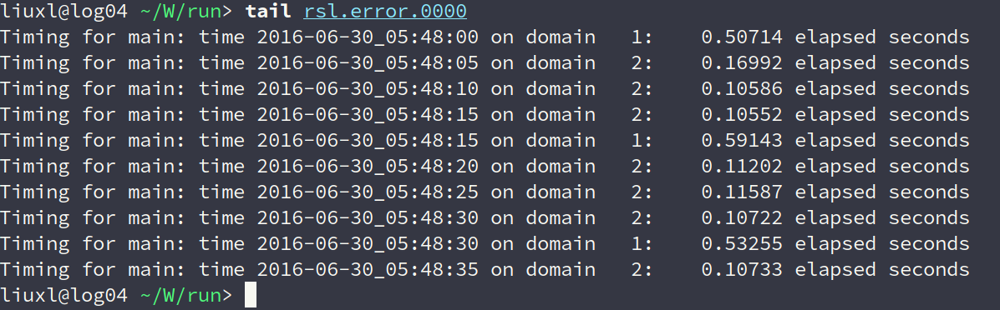
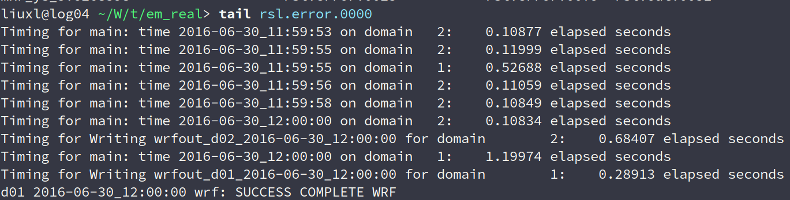

### **湖北个例模拟情况**
#### &nbsp;&nbsp;&nbsp;&nbsp;&nbsp;&nbsp;&nbsp;&nbsp;模拟时间为2016年6月30日，00时至12时
----
### 将外层网格距由3km设置为9km两次实验
---
#### 时间步长为15s，微物理方案为8，计算了3小时31分，未能成功转完。

<figure>

</figure>

----
#### 时间步长为5s，微物理方案为8，模式成功转完。

<figure>

</figure>

----
### 目前思路：
----
#### 1 学习使用Registry来控制WRF内部变量减小输出
#### 2 继续调整namelist.input 保持内外嵌套网格据为3km，1km。缩小区域减少网格数目，减小时间步长
