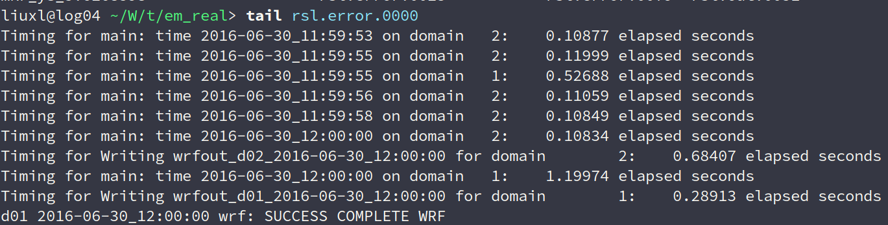

### **湖北个例模拟情况**
#### &nbsp;&nbsp;&nbsp;&nbsp;&nbsp;&nbsp;&nbsp;&nbsp;模拟时间为2016年6月30日，00时至12时
----

#### 时间步长为15s，微物理方案为8，计算了1分钟30秒

<figure>

</figure>

----
#### 时间步长为15s，微物理方案为8，计算了1分钟25秒

<figure>

</figure>

----
#### 时间步长为15s，微物理方案为10，计算了1分钟35秒

<figure>

</figure>

----
#### 时间步长为15s，微物理方案为16，计算了1分钟30秒

<figure>

</figure>

----
#### 时间步长为15s，微物理方案为17，计算了1小时30分

<figure>

</figure>

----
#### 时间步长为1s，微物理方案为8，计算了3小时31分

<figure>

</figure>

----
### 将网格距设置为9km的两次实验
---
#### 时间步长为15s，微物理方案为8，计算了3小时31分

<figure>

</figure>

----
#### 时间步长为5s，微物理方案为8，模式成功转完。

<figure>

</figure>

----

